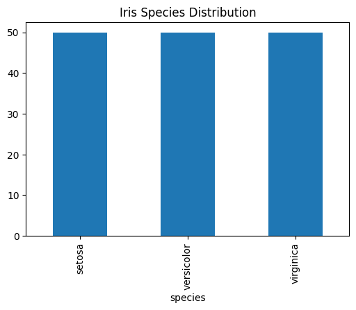
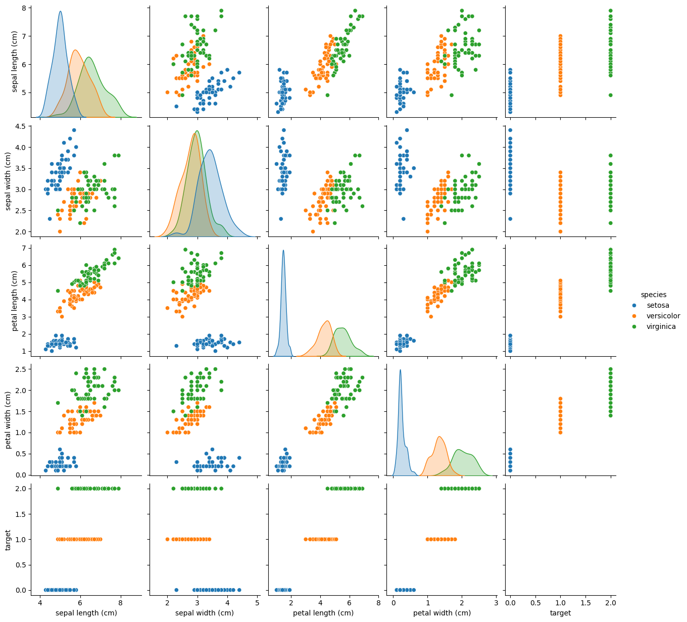
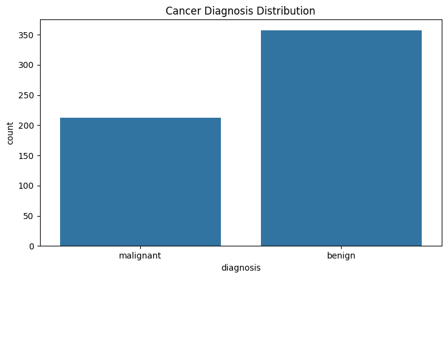
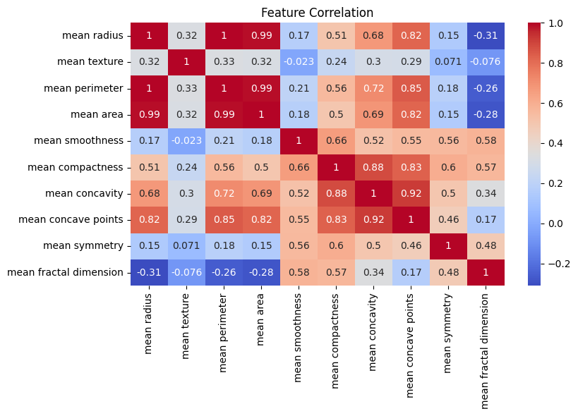

# 🧠 Classification Algorithms Benchmark

## 📌 Project Overview
This project benchmarks multiple **classification algorithms** on different datasets (Iris & Cancer Diagnosis).  
The workflow covers **data preprocessing, model training, evaluation, and cross-validation** to identify the best-performing model for deployment.

---

## 🚀 Implemented Tasks

### 1. Data Exploration & Preprocessing
- Load and inspect the dataset (first rows, data types, null values).
- Handle missing values (if any).
- Standardize/Normalize the data (important for Logistic Regression & SVM).
- Split dataset into **80% training** and **20% testing**.

#### 🔍 Visualizations

**Iris Dataset**
- Species distribution is balanced (50 samples each).
- Pairplot shows clear separability between species.




**Cancer Diagnosis Dataset**
- More benign than malignant cases.
- Strong correlations between some features (e.g., radius, perimeter, area).

  



---

### 2. Model Building & Training
- **Logistic Regression**
- **Decision Tree (DT)**
- **Naive Bayes**
- **Support Vector Machine (SVM, linear kernel)**

Each model is trained on the training set and evaluated on both training and test sets.

---

### 3. Model Evaluation
- **Confusion Matrix** (visualization)
- **Precision, Recall, F1-Score**
- **Accuracy comparison**
- **Computational time** (training & prediction)

---

### 4. Cross-Validation
- Applied **k-Fold Cross Validation (k=5)** for all models.
- Compared cross-validation results with train-test split performance.

---

### 5. Final Model Comparison & Report
- Compared models based on:
  - Test Accuracy
  - Precision, Recall, F1-Score
  - Time Complexity
- Recommended the best model for deployment.

---

## 📊 Results & Insights
- Logistic Regression: Stable performance, good for linearly separable data.
- Decision Tree: Fast training, interpretable, but prone to overfitting.
- Naive Bayes: Very fast, works well with high-dimensional data.
- SVM (linear): Strong performance with normalized data, but higher computational cost.

**Key Takeaway:**  
- If **speed** is critical → Naive Bayes.  
- If **interpretability** is needed → Decision Tree.  
- If **accuracy & balanced metrics** are the priority → Logistic Regression or SVM.  

---

## 🛠️ Tech Stack
- Python 3.x
- NumPy, Pandas
- Scikit-learn
- Matplotlib, Seaborn

---

## 📂 Project Structure
```
├── notebooks/           # Jupyter notebooks for exploration
├── src/                 # Python scripts for preprocessing & models
├── results/             # Evaluation metrics & plots (screenshots)
└── README.md            # Project documentation
```

---

## 📌 How to Run
1. Clone the repository:
   ```bash
   git clone https://github.com/mnzeiter/classification-algorithms-benchmark.git
   cd classification-algorithms-benchmark
   ```
2. Install dependencies:
   ```bash
   pip install -r requirements.txt
   ```
3. Run the notebook or scripts:
   ```bash
   jupyter notebook notebooks/
   ```

---

## 📖 Author
Developed by **Mohammad N. AL-Zeiter**
M.Sc. in Computer Science | Full Stack & Data Engineer

---

## 🌐 Connect with Me
- 💼 [LinkedIn](https://linkedin.com/in/mozeiter)
- 🌍 [Portfolio Website](https://mohammadalzeiter.com)
- 📧 Email: mohammadalzeiter@outlook.com

